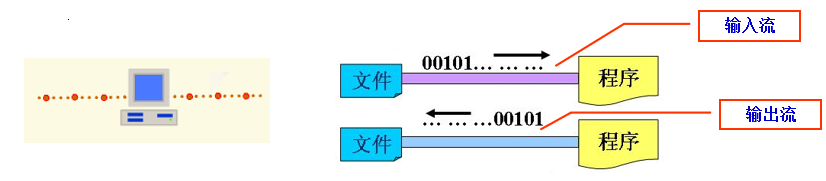

# 135-Java-流的概念及API.md

+ 流的概念
    + 流（Stream )的概念代表的是程序中数据的流通
    + 数据流是一串连续不断的数据的集合
    + 在Java程序中，对于数据的输入/输出操作是以流(Stream)的方式进行的
        + 输入流 — 流入程序的数据
        + 输出流 — 流出程序的数据
        + 在java程序中，从输入流读取数据（读到内存中），而从输出流输出数据（从内存存储到文件或显示到屏幕上）

+ 流的概念
    + 流的分类
        + 按流的方向不同
            + 输入流、输出流
        + 按处理数据的单位不同
            + 字节流、字符流
        + 按功能不同
            + 节点流、处理流
+ Java语言中，控制数据流的类都放在java.io包中

|	|字节流|	字符流|
| ----- | ------ | ---- |
|输入流	|InputStream|	Reader|
|输出流	|OutputStream	|Writer|

+ java.io包中有两大继承体系
    + 以byte处理为主的Stream类，他们的命名方式是XXXStream
    + 以字符处理为主的Reader / Writer类，他们的命名方式XXXReader或XXXWriter
+ InputStream、OutputStream、Reader、Writer这四个类，是这两大继承体系的父类

+ 流的层次结构图

+ 字节输入流的层次结构图

+ 字节输入流的主要方法
    + 此抽象类是表示输入字节流的所有类的超类
    + InputStream常用的方法 

|方法	|含义|
| ------ | ------ |
|int  read( )	|一次读取一个byte的数据，并以int类型把数据返回来，如果没有数据可以读了，会返回”-1”|
|int  read(byte[] buffer)	|把所读取到的数据放在这个byte数组中，返回一个int型的数据，这个int型数据存储了返回的真正读取到的数据byte数|
|int read(byte[] buffer,int offset,int length)	|读取length个字节，并存储到一个字节数组buffer中，并从offset位置开始返回实际读取的字节数|
|void close( )	|关闭此输入流并释放与该流关联的所有系统资源|

+ 字节输出流的层次结构图

+ 字节输出流的主要方法
    + 此抽象类是表示输出字节流的所有类的超类 
    + OutputStream常用的方法 

| 方法	|含义|
| ----- | ----- |
|void write(byte[] buffer)	|将要输出的数组先放在一个byte数组中，然后用这个方法一次把一组数据输出出去 |
|void write(byte[] buffer,int off,int len)	|将指定字节数组中从偏移量 off 开始的 len 个字节写入此输出流|
|abstract void write(int b)	|将指定的字节写入此输出流|
|void close( )	|关闭此输出流并释放与此流有关的所有系统资源| 
|void flush( )	|刷新此输出流并强制写出所有缓冲的输出字节 |

+ 字符输入流的层次结构图

+ 字符输入流的主要方法
    + 用于输入字符流的抽象类
    + Reader常用的方法 

|方法|	含义|
| ----- | ----- |
|int  read( )	|一次读取一个char的数据，并以int类型把数据返回来，如果没有数据可以读了，会返回”-1”|
|int  read(char[] cbuffer)|	把所读取到的数据放在这个char数组中，返回一个int型的数据，这个int型数据存储了返回的真正读取到的数据char数|
|int read(char[] cbuffer,int offset,int length)|	读取length个字符，并存储到一个字节数组cbuffer中，并从offset位置开始返回实际读取的字符数|
|void close( )	|关闭此Reader并释放与其关联的所有系统资源|

+ 字符输出流的层次结构图

+ 字符输出流的主要方法
    + 输出字符流的抽象类 
    + Writer常用的方法

|方法|	含义|
| ---- |  ---- |
|void write(char[] cbuffer)	|将要输出的数组先放在一个char数组中，然后用这个方法一次把一组数据输出出去|
|void write(char[] cbuffer,int off,int len)|	将指定字符数组中从偏移量 off 开始的 len 个字符写入此输出流|
|int write(int b)|	将指定的字符写入此输出流|
|void write(String str)|	写入字符串|
|void write(String str, int off,int len)|	将指定字符串中从偏移量 off 开始的 len 个字符写入此输出流|
|void close( )	|关闭此输出流并释放与此流有关的所有系统资源| 
|void flush( )	|刷新此输出流并强制写出所有缓冲的输出字符|

#### 拓展知识：

[Java 8 新特性](https://www.runoob.com/java/java8-new-features.html)

[java中 ->](https://blog.csdn.net/qq_38078822/article/details/80836539)

[Java8新特性5--流式API](https://www.jianshu.com/p/ae88f99f9cb9)

[Java 流API - w3cschool](https://www.w3cschool.cn/java/java-stream-api.html)

**以就就是我关于 *Java-流的概念及API*  知识点的整理与总结的全部内容**

==================================================================
#### 分割线
==================================================================

**博主为咯学编程：父母不同意学编程，现已断绝关系;恋人不同意学编程，现已分手;亲戚不同意学编程，现已断绝来往;老板不同意学编程,现已失业三十年。。。。。。如果此博文有帮到你欢迎打赏，金额不限。。。**

